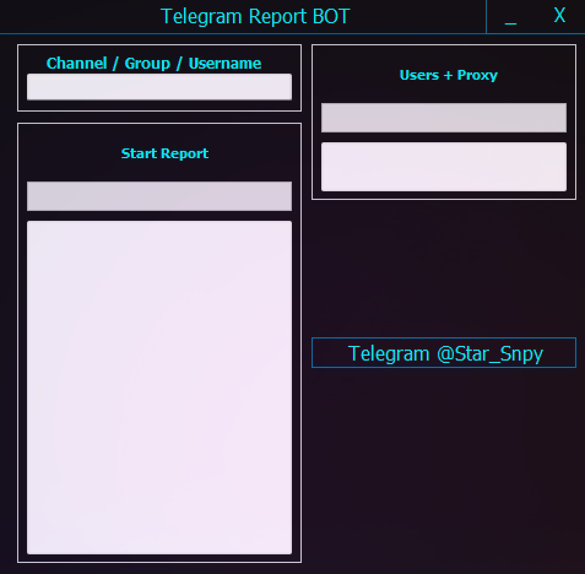

<p align="center"></p>

<h1 align="center">TELEGRAM REPORT BOT</h1>
<h2 align="center">Join our telegram here > <a href="https://tinyurl.com/5n7m38uw"></a></h2>

## What is a Bot/Tool for Reporting❓
   Definition of a Bot/Tool:.
  * <p>A bot/Tool is an automated software program designed to perform specific tasks online. In the context of social media platforms like Telegram, bots can be programmed to report users-channels-groups based on certain criteria.</p>
   Functionality of this Bot/Tool: 
* <p>Functionality of this Bot/Tool: When an user-channel-group is massively reported, regardless of the content on the user-channel-group, the user-channel-group will be deleted anyway. On Telegram, reporting bots are typically used to flag user-channel-group that violate community guidelines or exhibit spam-like behavior. the bot can submit reports without requiring human intervention.</p>


# How can i get this Bot/Tool or to report an account ❓
  * Join our telegram here > <a href="https://tinyurl.com/5n7m38uw"></a>
  * Check all the proof.
  * Below each video you will see our contact starting with @ contact us on that username.
</pre>
</p>
</details>


**Legal Notice**

```console
I am not accountable for any of your actions.
```

----
